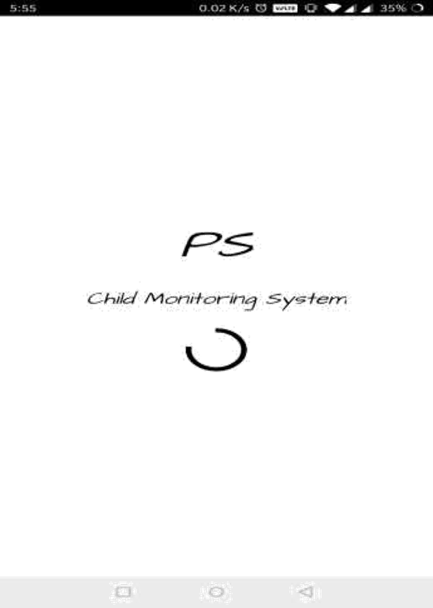
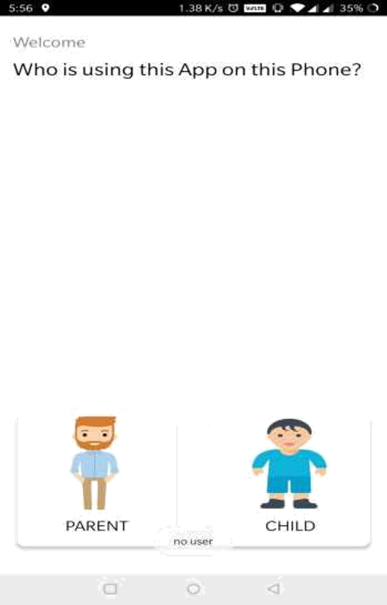
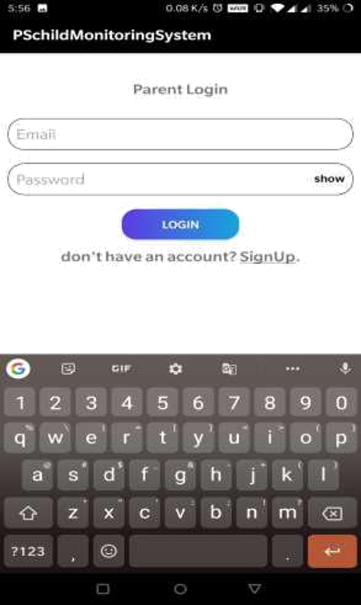
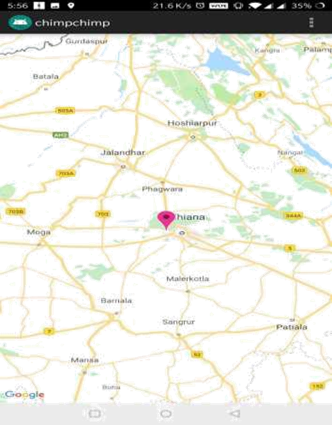
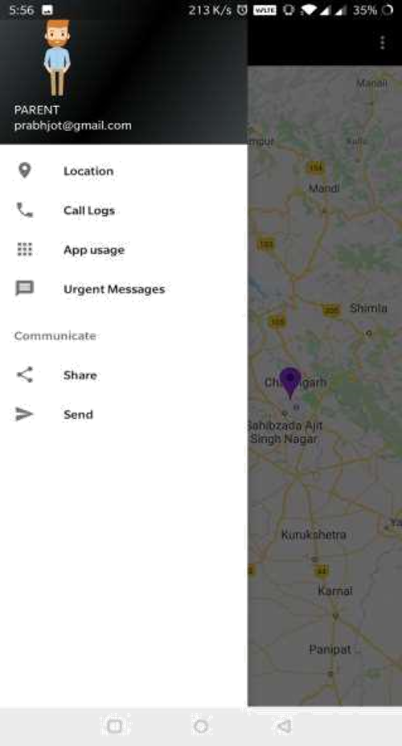
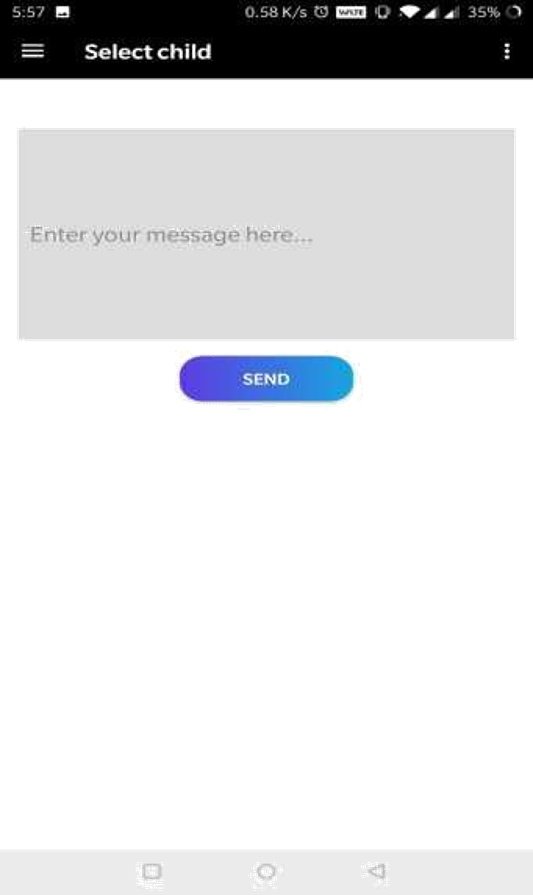

# childMonitoringSystem
Android Application on child monitoring System

Android application which get's all the data from child phone and sends it to the server where it get's stored
and updated on the timely basis,
it fetches data like location,call logs and phone activity.

it will be shown in parents application as all data which will be fetched will get updated on parent's device.

## NOTE : google play file is already been added here. you can use your own JSON file and add it to the project.
manually add your google-services.json file in the app module. 
I am adding some screenshots of my app with it!!

